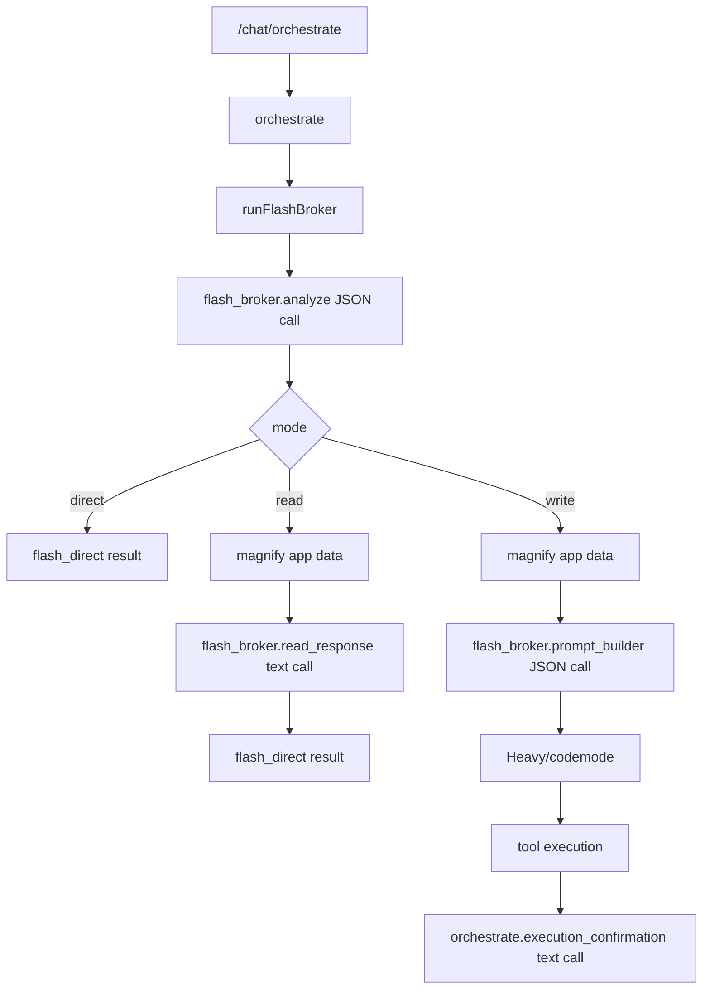

# Flash Fine-Tune Data Implementation Plan

This is a Flash-only implementation plan based on the current codebase. It is
not a redesign of the full inference system. The goal is to start collecting
properly tagged Flash training data now, with minimal behavior change, so a
single future Flash fine-tune can learn the full suite of Flash responsibilities.

## Executive Summary

The current Flash architecture is already concentrated enough to instrument
without a broad refactor. The main chokepoint is `api/services/flash-broker.ts`:

- `flash_broker.analyze`: classifies the turn, chooses direct/read/write mode,
  selects relevant apps/functions, plans conversation search, updates summary,
  and may delegate to a system agent.
- `flash_broker.read_response`: answers directly from magnified app/context
  data when the task is read-only.
- `flash_broker.prompt_builder`: constructs the final prompt for Heavy/code
  mode when the task requires code or tool execution.
- `orchestrate.execution_confirmation`: after a recipe executes,
  `api/services/orchestrator.ts` calls `callFlashText` to summarize the result.

The highest-leverage path is:

1. Define a stable Flash capability taxonomy.
2. Attach that taxonomy to every Flash call as telemetry metadata.
3. Store both request and response snapshots for Flash LLM calls using the
   existing invocation telemetry tables.
4. Build a Flash dataset exporter that pairs request, response, derived labels,
   downstream outcomes, and training eligibility into JSONL.
5. Only after data confirms it, change behavior such as skipping prompt-builder
   when the analyzer chose a pure system-agent escalation.

This avoids reworking routing or provider selection before launch. It uses the
existing chat capture and invocation telemetry foundation.

## Current Flash Pipeline

### Entry Points

- `api/handlers/chat.ts` creates `captureTraceId` and `captureConversationId`
  for `/chat/orchestrate`, starts `createOrchestrateCaptureSession`, and passes
  telemetry to `orchestrate`.
- `api/services/orchestrator.ts` receives telemetry in `OrchestrateOptions`.
  Heavy already uses `createLlmInvocationTelemetrySession`.
- `api/services/orchestrator.ts` calls `runFlashBroker`, but does not pass the
  telemetry context into it yet.
- `api/services/flash-broker.ts` owns all three primary Flash calls through
  private `callFlash` and exported `callFlashText`.

### Flash Call Graph



### As-Is Behavior Worth Preserving

- Flash calls are OpenAI-compatible through `fetchInferenceChatCompletion`.
- Provider/model selection is already route-aware through `resolveInferenceRoute`
  and `selectInferenceModel`.
- Chat capture already records user-visible orchestration events.
- Invocation telemetry already has `llm_invocations`,
  `llm_context_snapshots`, and `training_annotations`.
- The migration already allows arbitrary `metadata` JSONB, so Flash capability
  tagging does not require a database migration.

### Main Gaps

- `runFlashBroker` does not receive the trace/conversation telemetry context
  that already exists in `orchestrator`.
- `callFlash` and `callFlashText` do not create invocation telemetry sessions.
- `LlmInvocationTelemetrySession` stores request snapshots, but not response
  snapshots.
- Flash calls are not tagged with stable task IDs or capability labels.
- Prompt builder may run even when a pure system-agent escalation will cause
  `orchestrator` to return before Heavy. This should be measured before changing.
- Admin JSONL export includes row metadata, but not an explicit Flash fine-tune
  dataset format.

## Source Evidence Map

The key code locations behind this plan:

| Area | Source location | Evidence |
| --- | --- | --- |
| Chat trace creation | `api/handlers/chat.ts:1010` | `/chat/orchestrate` creates `captureConversationId` and `captureTraceId`. |
| Orchestrator telemetry option | `api/services/orchestrator.ts:115` | `OrchestrateOptions` already accepts `telemetry`. |
| Flash broker call | `api/services/orchestrator.ts:151` | `runFlashBroker` is called without passing `options.telemetry`. |
| System-agent handling | `api/services/orchestrator.ts:235` | Delegations are processed after `runFlashBroker` completes. |
| Tool discovery return | `api/services/orchestrator.ts:238` | `tool_marketer` returns a discover widget and stops before Heavy. |
| Flash confirmation call | `api/services/orchestrator.ts:477` | Post-execution confirmation uses `callFlashText`. |
| Heavy telemetry precedent | `api/services/orchestrator.ts:557` | Heavy already creates an LLM telemetry session. |
| Broker signature | `api/services/flash-broker.ts:294` | `runFlashBroker` has no telemetry argument. |
| Analyze callsite | `api/services/flash-broker.ts:479` | Stage 1 analyze calls `callFlash`. |
| Read branch | `api/services/flash-broker.ts:704` | Read mode uses magnified data and answers directly. |
| Read callsite | `api/services/flash-broker.ts:752` | Read response calls `callFlashText`. |
| Prompt-builder callsite | `api/services/flash-broker.ts:832` | Write mode calls `callFlash` for final Heavy prompt JSON. |
| JSON Flash helper | `api/services/flash-broker.ts:1152` | `callFlash` posts OpenAI-compatible JSON-mode requests. |
| Text Flash helper | `api/services/flash-broker.ts:1202` | `callFlashText` posts OpenAI-compatible text requests. |
| Fallback path | `api/services/flash-broker.ts:1555` | `heuristicFallback` returns structured fallback output when analyze fails. |
| Invocation init type | `api/services/invocation-telemetry.ts:15` | Telemetry init already supports trace, phase, provider, model, params, messages, metadata. |
| Invocation finish type | `api/services/invocation-telemetry.ts:35` | Finish currently lacks response snapshot support. |
| Request snapshot store | `api/services/invocation-telemetry.ts:367` | Request snapshots are already stored as JSON artifacts. |
| Snapshot row insert | `api/services/invocation-telemetry.ts:382` | `llm_context_snapshots` rows are inserted with `snapshot_type`. |
| Training annotations table | `supabase/migrations/20260429133000_invocation_telemetry_foundation.sql:104` | `training_annotations` already exists. |
| Generic JSONL export | `api/services/capture-inspection.ts:775` | Existing capture export emits row-level JSONL but not Flash-specific dataset rows. |

## Flash Capability Taxonomy

The fine-tuned Flash model should be trained as one model with multiple tasks,
not as separate models for every internal helper. The metadata needs to tell us
which capability each call exercised.

### Task IDs

These are stable component IDs for LLM invocations:

| Task ID | Current source | Output shape | Notes |
| --- | --- | --- | --- |
| `flash_broker.analyze` | `api/services/flash-broker.ts` | JSON | First and most important call. It decides routing, app/function relevance, conversation search, summary update, and system-agent delegation. |
| `flash_broker.read_response` | `api/services/flash-broker.ts` | Text | Direct answer grounded in magnified data and conversation/project context. |
| `flash_broker.prompt_builder` | `api/services/flash-broker.ts` | JSON | Builds Heavy/code-mode prompt, resolves entities, captures conventions, chooses Heavy model. |
| `orchestrate.execution_confirmation` | `api/services/orchestrator.ts` | Text | Brief post-execution confirmation using the user request and execution result. |
| `flash_broker.heuristic_fallback` | `api/services/flash-broker.ts` | Structured local fallback | Not an LLM call, but should be tagged as a fallback outcome for dataset filtering. |

### Capability Labels

Attach one or more labels to every Flash call:

| Capability | Meaning | Usually attached to |
| --- | --- | --- |
| `turn_mode_classification` | Decide direct vs read vs write. | `flash_broker.analyze` |
| `escalation_selection` | Decide whether to stay Flash or escalate. | `flash_broker.analyze` |
| `system_agent_delegation` | Delegate to tool discovery/building/platform help. | `flash_broker.analyze` |
| `app_relevance_selection` | Choose app slugs/IDs relevant to the turn. | `flash_broker.analyze` |
| `function_selection` | Choose write/action functions. | `flash_broker.analyze` |
| `magnification_planning` | Emit contextQuery/scopes for app data retrieval. | `flash_broker.analyze` |
| `conversation_search_planning` | Decide whether past conversation search is needed. | `flash_broker.analyze` |
| `conversation_summary_update` | Produce updated rolling summary. | `flash_broker.analyze` |
| `grounded_read_answer` | Answer directly from live/magnified context. | `flash_broker.read_response` |
| `heavy_prompt_construction` | Produce prompt consumed by Heavy/code mode. | `flash_broker.prompt_builder` |
| `entity_resolution` | Resolve names to IDs from magnified data. | `flash_broker.prompt_builder` |
| `schema_conditioning` | Condition output on app function schemas/types. | `flash_broker.prompt_builder` |
| `execution_confirmation` | Summarize completed action. | `orchestrate.execution_confirmation` |
| `json_structured_output` | JSON-mode structured generation. | `flash_broker.analyze`, `flash_broker.prompt_builder` |
| `multimodal_context` | Input included image/file parts. | Any Flash task with files |
| `project_context_conditioning` | Input included local project context. | Analyze/read/prompt-builder |
| `heuristic_fallback` | Local fallback path was used. | `flash_broker.heuristic_fallback` |

### Escalation Target

This is the key label for the user-level Flash capability:

| Metadata value | Current code equivalent |
| --- | --- |
| `none` | Direct response, no escalation. |
| `flash_read_response` | Read mode, Flash answers from magnified context. |
| `heavy_codemode` | Write mode, prompt builder sends task to Heavy/code mode. |
| `tool_dealer` | Current `tool_marketer` delegation. It surfaces matching marketplace apps/tools. |
| `tool_maker` | Current `tool_builder` delegation. |
| `platform_guide` | Current `platform_manager` delegation. |
| `mixed` | Analyzer returned both code-mode needs and one or more system-agent delegations. |
| `unknown` | Parse failure or fallback could not determine target. |

Important current behavior: `tool_marketer` causes `orchestrator` to return a
discovery widget after `runFlashBroker` completes. Today, `runFlashBroker` may
still execute magnification and prompt-builder first if the analyzer returned
write mode. That may be wasted work, but it should be measured before changing.

## Proposed Metadata Shape

Each Flash LLM invocation should include metadata similar to this:

```json
{
  "tier": "flash",
  "component_id": "flash_broker.analyze",
  "schema_id": "flash_broker.analyze.v1",
  "capabilities": [
    "turn_mode_classification",
    "escalation_selection",
    "app_relevance_selection",
    "function_selection",
    "magnification_planning",
    "json_structured_output"
  ],
  "input_features": {
    "has_files": false,
    "has_image_files": false,
    "has_project_context": true,
    "conversation_history_count": 12,
    "available_function_count": 38,
    "scope_mode": "scoped"
  },
  "route": {
    "provider": "ultralight",
    "upstream_provider": "deepseek",
    "billing_mode": "light",
    "key_source": "platform_deepseek"
  },
  "output_labels": {
    "parse_success": true,
    "mode": "write",
    "escalation_target": "heavy_codemode",
    "relevant_app_count": 2,
    "action_function_count": 3,
    "system_agent_delegation_count": 0,
    "conversation_search_requested": false,
    "context_query_present": true
  }
}
```

For prompt-builder:

```json
{
  "tier": "flash",
  "component_id": "flash_broker.prompt_builder",
  "schema_id": "flash_broker.prompt_builder.v1",
  "capabilities": [
    "heavy_prompt_construction",
    "entity_resolution",
    "schema_conditioning",
    "json_structured_output"
  ],
  "input_features": {
    "magnified_app_count": 2,
    "magnified_context_bytes": 14720,
    "function_count": 5,
    "convention_count": 4
  },
  "output_labels": {
    "parse_success": true,
    "selected_heavy_model": "deepseek-v4-pro",
    "entity_count": 3,
    "convention_count": 4,
    "prompt_bytes": 11890
  }
}
```

## Implementation PRs

### PR 1: Add Flash Taxonomy And Metadata Helpers

Purpose: establish stable tags before changing telemetry or exports.

Files:

- Add `api/services/flash-finetune-metadata.ts`
- Add `api/services/flash-finetune-metadata.test.ts`
- No runtime behavior changes.

Implementation details:

- Export literal union types:
  - `FlashTaskId`
  - `FlashCapability`
  - `FlashEscalationTarget`
  - `FlashOutputShape`
- Export schema IDs:
  - `flash_broker.analyze.v1`
  - `flash_broker.read_response.v1`
  - `flash_broker.prompt_builder.v1`
  - `orchestrate.execution_confirmation.v1`
- Export helpers:
  - `inferFlashEscalationTarget(input)`
  - `buildFlashInputFeatures(input)`
  - `buildAnalyzeOutputLabels(output)`
  - `buildPromptBuilderOutputLabels(output)`
  - `buildReadResponseOutputLabels(text)`
  - `buildExecutionConfirmationOutputLabels(text)`
- Keep helpers pure and deterministic.

Acceptance criteria:

- Tests cover direct, read, write, pure `tool_marketer`, pure `tool_builder`,
  pure `platform_manager`, and mixed code-mode + system-agent delegation.
- No production files import the helper yet, unless the PR is intentionally
  combined with PR 2.

Engineering effort: S.

### PR 2: Thread Flash Telemetry Context Into The Broker

Purpose: make the existing trace ID available at Flash callsites.

Files:

- Update `api/services/orchestrator.ts`
- Update `api/services/flash-broker.ts`

Implementation details:

- Extend `runFlashBroker` with one optional final argument:

```ts
telemetry?: {
  traceId: string;
  conversationId?: string;
  source?: string;
}
```

- Pass `options.telemetry` from `orchestrate` into `runFlashBroker`.
- Inside `runFlashBroker`, enrich it with `userId` and `userEmail` before
  calling `callFlash` or `callFlashText`.
- Do not alter model selection, prompts, modes, or returned events.

Acceptance criteria:

- Existing direct/read/write behavior is unchanged.
- TypeScript compiles.
- A unit or integration-style test verifies that `runFlashBroker` can still be
  called without telemetry.

Engineering effort: S.

### PR 3: Record Flash LLM Invocations With Request And Response Snapshots

Purpose: collect training examples for every Flash LLM call.

Files:

- Update `api/services/flash-broker.ts`
- Update `api/services/orchestrator.ts`
- Update `api/services/invocation-telemetry.ts`
- Update `api/services/invocation-telemetry.test.ts`
- Add or update tests around Flash metadata helpers.

Implementation details:

- Extend `LlmInvocationFinishInput` with an optional response snapshot:

```ts
responseSnapshot?: {
  value: unknown;
  snapshotType?: "llm_response";
  metadata?: Record<string, unknown>;
}
```

- In `LlmInvocationTelemetrySession.finish`, if `responseSnapshot` exists,
  call the existing `storeJsonSnapshot` helper and insert a second row into
  `llm_context_snapshots` with `snapshot_type = 'llm_response'`.
- Extend `callFlash` with an options object:

```ts
type FlashCallOptions = {
  telemetry?: FlashTelemetryContext;
  taskId: FlashTaskId;
  schemaId: string;
  capabilities: FlashCapability[];
  inputFeatures?: Record<string, unknown>;
  metadata?: Record<string, unknown>;
};
```

- Extend `callFlashText` the same way, but keep the options parameter optional
  so the current exported caller contract remains compatible.
- Create one telemetry invocation per Flash call:
  - `phase = taskId`
  - `source = telemetry.source || 'orchestrate'`
  - `provider = route.provider`
  - `requestedModel = model`
  - `resolvedModel = model`
  - `billingMode = route.billingMode`
  - `keySource = route.keySource`
  - `requestParams` should include temperature, max_tokens, response_format,
    and stream flag if applicable.
  - `metadata` should include `tier`, `component_id`, `schema_id`,
    `capabilities`, route summary, and input features.
- On success, finish with `status = 'success'`, usage, and response snapshot.
- On provider error, finish with `status = 'error'`, error type
  `provider_error`, status code, and response text preview if available.
- On JSON parse error in `callFlash`, finish with `status = 'error'`,
  error type `json_parse_error`, raw content preview, and return `null` to keep
  existing fallback behavior.

Acceptance criteria:

- Direct path records one Flash LLM invocation:
  `flash_broker.analyze`.
- Read path records two:
  `flash_broker.analyze` and `flash_broker.read_response`.
- Write path records two:
  `flash_broker.analyze` and `flash_broker.prompt_builder`.
- Post-execution confirmation records:
  `orchestrate.execution_confirmation`.
- Capture disabled still produces no telemetry session and no behavior change.
- `llm_context_snapshots` contains both `llm_request` and `llm_response` rows
  for each successful Flash call.

Engineering effort: M.

### PR 4: Add Flash Outcome Labels From Existing Orchestration Events

Purpose: turn raw logs into useful supervised examples without human labeling
every row.

Files:

- Add `api/services/flash-training-labels.ts`
- Add `api/services/flash-training-labels.test.ts`
- Optionally update `api/services/chat-capture.ts` only if a small additional
  event field is needed.

Implementation details:

- Build deterministic label derivation from existing rows:
  - `chat_events`
  - `llm_invocations`
  - `llm_context_snapshots`
  - `tool_invocations`
  - `execution_failures`
  - `training_annotations`
- Derived labels for `flash_broker.analyze`:
  - `mode`
  - `escalation_target`
  - `parse_success`
  - `fallback_used`
  - `relevant_app_count`
  - `action_function_count`
  - `system_agent_delegation_count`
  - `conversation_search_requested`
  - `context_query_present`
  - `downstream_heavy_called`
  - `downstream_plan_ready`
  - `downstream_execution_success`
  - `downstream_user_visible_error`
- Derived labels for `flash_broker.prompt_builder`:
  - `parse_success`
  - `selected_heavy_model`
  - `prompt_bytes`
  - `entity_count`
  - `convention_count`
  - `downstream_recipe_parsed`
  - `downstream_execution_success`
- Derived labels for `flash_broker.read_response`:
  - `nonempty_response`
  - `response_bytes`
  - `conversation_search_used`
  - `grounded_context_app_count`
- Derived labels for `orchestrate.execution_confirmation`:
  - `nonempty_response`
  - `response_bytes`
  - `execution_result_available`
- Store labels either in:
  - the dataset export only, for fastest launch, or
  - `training_annotations`, if the team wants an auditable annotation table.

Acceptance criteria:

- Label derivation is deterministic and testable from fixture rows.
- No model call is needed to create first-pass labels.
- Human review can later override or supplement labels through
  `training_annotations`.

Engineering effort: M.

### PR 5: Build Flash Fine-Tune Dataset Export

Purpose: produce JSONL rows ready for teacher review, curation, fine-tuning, and
eval construction.

Files:

- Add `api/services/flash-training-export.ts`
- Add `api/services/flash-training-export.test.ts`
- Add admin handler route in `api/handlers/admin.ts`, or add a script under
  `scripts/analysis/` if the team prefers offline export first.
- Potentially update `api/services/capture-inspection.ts` if reusing the
  existing capture export pipeline.

Implementation details:

- Export only rows with:
  - `metadata.tier = 'flash'`
  - allowed `component_id`
  - successful request snapshot
  - response snapshot or explicit parse/provider error label
  - training eligibility not marked rejected
- Output one JSONL object per invocation:

```json
{
  "id": "trace:task:uuid",
  "trace_id": "00000000-0000-4000-8000-000000000001",
  "conversation_id": "conv-123",
  "component_id": "flash_broker.analyze",
  "schema_id": "flash_broker.analyze.v1",
  "capabilities": ["turn_mode_classification", "escalation_selection"],
  "provider": "ultralight",
  "model": "deepseek-v4-flash",
  "messages": [
    { "role": "system", "content": "..." },
    { "role": "user", "content": "..." }
  ],
  "target": {
    "type": "json",
    "content": { "mode": "write", "relevantApps": ["..."] }
  },
  "labels": {
    "escalation_target": "heavy_codemode",
    "downstream_execution_success": true
  },
  "usage": {
    "prompt_tokens": 1200,
    "completion_tokens": 180
  },
  "training_eligibility": "pending"
}
```

- The exporter must fetch full artifact text for request/response snapshots,
  not just `text_preview`. Current generic JSONL export includes metadata and
  previews; full training data needs artifact content from R2 or the artifact
  store.
- Provide filters:
  - by date range
  - by component ID
  - by schema ID
  - by training eligibility
  - by parse success
  - by downstream success
  - by max prompt bytes

Acceptance criteria:

- Export can produce separate files for:
  - `flash_broker.analyze`
  - `flash_broker.read_response`
  - `flash_broker.prompt_builder`
  - `orchestrate.execution_confirmation`
  - all Flash tasks combined
- Every row has a stable `component_id`, `schema_id`, `capabilities`, and
  `labels` object.
- No CLOB or BioASM components are included.
- Export fails closed if full artifact text cannot be fetched, unless an
  explicit `--allow-preview-only` flag is supplied for debugging.

Engineering effort: M/L depending on whether artifact-content export is done
server-side or as an ops script.

### PR 6: Add A Flash Data Quality Dashboard Or Smoke Command

Purpose: know whether the collected data is useful before paying for
fine-tuning.

Files:

- Add `scripts/smoke/flash-finetune-data-smoke.mjs`, or
- Add an admin capture overview section if the team wants this in the UI.

Implementation details:

Report:

- number of Flash invocations by `component_id`
- parse failure rate by JSON task
- fallback rate
- average prompt/completion tokens
- percentage with response snapshots
- percentage with downstream success labels
- escalation target distribution
- prompt-builder calls where `escalation_target != heavy_codemode`
- top schemas and top models

Acceptance criteria:

- The command can run after a production/staging export.
- It gives a simple go/no-go data-readiness report for the first fine-tune.

Engineering effort: S/M.

### PR 7: Optional Behavior Cleanup After Measurement

Purpose: reduce wasted Flash work once metadata proves the waste exists.

Files:

- Update `api/services/flash-broker.ts`
- Update `api/services/orchestrator.ts`
- Add tests around system-agent-only delegation.

Potential behavior change:

- If analyzer returns a pure `tool_marketer`/`tool_builder`/`platform_manager`
  escalation with no Heavy/code-mode work, skip `flash_broker.prompt_builder`.
- Return a broker result that preserves the delegation and avoids unnecessary
  magnification/prompt-building.

Acceptance criteria:

- Existing direct/read/write paths unchanged.
- Pure tool discovery still returns the same discovery widget.
- Pure tool maker/platform guide still emits the same `system_agent_spawn`.
- Mixed cases still allow Heavy/code-mode prompt construction.

Engineering effort: M.

This PR should not come first. Instrument first, measure second, change
behavior third.

## Recommended PR Order

1. PR 1: Add Flash taxonomy and metadata helpers.
2. PR 2: Thread telemetry context into `runFlashBroker`.
3. PR 3: Record Flash LLM invocations with request/response snapshots.
4. PR 4: Add deterministic outcome labels.
5. PR 5: Build the Flash fine-tune dataset exporter.
6. PR 6: Add data quality smoke/dashboard.
7. PR 7: Optional behavior cleanup after measurement.

The first three PRs unlock data capture. PR 4 and PR 5 turn capture into
trainable JSONL. PR 6 prevents bad fine-tunes. PR 7 is optimization, not a
launch blocker.

## What The First Flash Fine-Tune Should Learn

The first Flash model should not merely imitate one prompt. It should learn the
shared Flash operator role:

- classify intent and turn mode
- decide whether to stay Flash or escalate
- choose system-agent target when needed
- choose relevant apps/functions
- plan magnification/context queries
- answer grounded read-only questions
- build Heavy/code-mode prompts
- resolve entities from app data
- produce reliable JSON under schema pressure
- summarize execution results briefly

That means the combined dataset should include all four LLM task IDs, with the
task ID and capability labels included in metadata. During fine-tuning, the
task can be encoded as either:

- a system prompt prefix, such as `Task: flash_broker.analyze`, or
- an explicit metadata/input wrapper, if the fine-tune provider supports it.

For production serving, the same fine-tuned model can sit behind the existing
OpenAI-compatible route. The app will still call analyze/read/prompt-builder as
separate tasks, but they can all hit the same Flash fine-tuned endpoint.

## Initial Eval Harness

Use held-out production examples plus synthetic/teacher-labeled edge cases.

### Analyze Eval

Metrics:

- JSON validity: target >= 99.5 percent
- mode accuracy vs accepted baseline: target >= 97 percent
- escalation target accuracy: target >= 97 percent
- relevant app recall: target >= 95 percent where labels exist
- action function precision: target >= 95 percent
- no unnecessary Heavy escalation on known-direct prompts: target >= 98 percent

Baseline:

- Current DeepSeek Flash production outputs plus downstream success labels.

Ramp threshold:

- Equal or better than baseline on JSON validity and escalation target.
- No regression above agreed threshold in direct/read/write routing.

### Prompt Builder Eval

Metrics:

- JSON validity: target >= 99.5 percent
- includes required tool/function names: target >= 98 percent
- entity ID resolution accuracy: target >= 95 percent on labeled rows
- downstream recipe parse success: no worse than baseline
- downstream execution success: no worse than baseline

Baseline:

- Current prompt-builder outputs and Heavy execution outcomes.

Ramp threshold:

- No significant drop in Heavy plan parsing or execution success.

### Read Response Eval

Metrics:

- nonempty answer rate
- grounded answer rubric from teacher model or human review
- app/context attribution coverage where applicable
- refusal/uncertainty behavior on missing data

Baseline:

- Current Flash read-response output.

Ramp threshold:

- Equal or better teacher/human rubric score on a curated read-only set.

## Open Design Questions

1. Should `tool_dealer`, `tool_maker`, and `platform_guide` be the canonical
   metadata names, or should metadata use the current code names
   `tool_marketer`, `tool_builder`, and `platform_manager` with aliases?
2. Is prompt-builder currently expected to run for pure system-agent delegation,
   or is that accidental waste?
3. Should `orchestrate.execution_confirmation` be part of the first Flash
   fine-tune, or kept separate until after analyze/prompt-builder are strong?
4. Should derived labels be written into `training_annotations`, or generated
   only at export time for the first iteration?
5. What data retention and redaction rules should apply before examples are
   eligible for fine-tuning?
6. Should low-quality rows be excluded based only on deterministic labels, or
   should a teacher model score the first export before training?
7. Which provider will own the first Flash fine-tune format constraints:
   Cerebras-hosted open weights, OpenPipe curation, Together fine-tune/export,
   or an internal LoRA/SFT path followed by Cerebras deployment?

## Bottom Line

The codebase is close enough to start preparing Flash data without a large
system refactor. The optimal path is not to change routing first. It is to add
stable Flash task/capability metadata, capture request and response snapshots,
derive downstream outcome labels, and export high-quality JSONL. Once real data
shows which sub-capabilities dominate cost and failure, then we can decide
whether to split tasks, skip unnecessary prompt-builder calls, or adjust the
Flash prompt schemas before the first production fine-tune.
