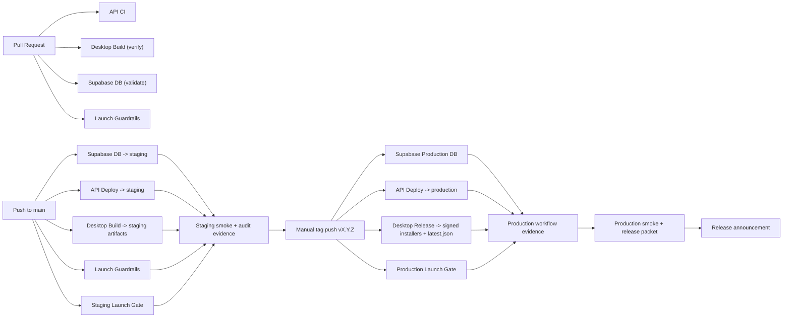

# Release Topology

Last reviewed: `2026-04-21`

This document is the canonical map of how Ultralight moves from source control
to staging and then to production across the API, database, and desktop
surfaces.

Use this as the release-topology source of truth. The more procedural operator
steps still live in
[docs/RELEASE_RUNBOOK.md](RELEASE_RUNBOOK.md),
but that runbook should not be the place where someone first learns the shape
of the system. The detailed staging/production resource inventory and
exception register now live in
[docs/ENVIRONMENT_ISOLATION_MATRIX.md](ENVIRONMENT_ISOLATION_MATRIX.md).

## Canonical Statement

Ultralight promotes release candidates through this chain:

1. Pull requests verify code and packaging inputs.
2. Pushes to `main` produce the staging candidate:
   - API verified and deployed to staging
   - Supabase migrations validated and pushed to staging
   - desktop staging artifacts built
3. Staging smoke and audit evidence are reviewed.
4. A version tag like `v0.1.0` is the manual promotion step to production.
5. Tag-triggered workflows deploy:
   - production schema
   - production API Worker
   - signed production desktop installers and updater metadata
6. Production smoke runs before release announcement.

This is the standard release path. Anything outside that chain is either a
secondary runtime, a diagnostic alias, or a documented exception.

## Promotion Flow

## Release-Critical Workflows

| Workflow | Trigger | Environment target | Required environment / secrets | Primary artifact / output | Promotion role |
| --- | --- | --- | --- | --- | --- |
| [`.github/workflows/api-ci.yml`](../.github/workflows/api-ci.yml) | PRs touching `api/**`, `apps/**`, `shared/**`, `supabase/**`, checks, and `main` pushes | CI only | none beyond repo checkout and package install | contract generation, guardrails, unused/deps baselines, typecheck, tests, Wrangler dry runs | proves API candidate is structurally releasable |
| [`.github/workflows/launch-guardrails.yml`](../.github/workflows/launch-guardrails.yml) | PRs and `main` pushes | CI only | none beyond repo checkout and Node runtime | reviewed launch-risk baseline checks | protects against regressions in token transport, wildcard CORS, placeholder runtime copy, archive artifacts, and other guarded patterns |
| [`.github/workflows/supabase-db.yml`](../.github/workflows/supabase-db.yml) | PRs touching `supabase/**`, `main` pushes, manual dispatch | staging | GitHub `staging` environment with `SUPABASE_ACCESS_TOKEN`, `SUPABASE_STAGING_PROJECT_ID`, `SUPABASE_STAGING_DB_PASSWORD` | validated migration set and staging schema push | produces the staging DB candidate |
| [`.github/workflows/api-deploy.yml`](../.github/workflows/api-deploy.yml) | `main` pushes, `v*` tags, manual dispatch | staging on `main`, production on tags | GitHub `staging` or `production` env with `CLOUDFLARE_API_TOKEN`, `CLOUDFLARE_ACCOUNT_ID` | deployed Cloudflare Worker | promotes the main API to staging or production |
| [`.github/workflows/desktop-build.yml`](../.github/workflows/desktop-build.yml) | PRs touching `desktop/**`, `main` pushes, manual dispatch | CI verify plus staging-channel artifacts on `main` | build-time `ULTRALIGHT_DESKTOP_BUILD_CHANNEL=staging` | staging desktop bundles for macOS and Windows | produces the desktop staging candidate |
| [`.github/workflows/launch-gate-staging.yml`](../.github/workflows/launch-gate-staging.yml) | `main` pushes touching release-critical surfaces, manual dispatch | staging gate | GitHub `GITHUB_TOKEN` with `actions:read` | SHA-scoped gate summary and artifact bundle linking required staging workflows | aggregates the current staging candidate into one explicit gate |
| [`.github/workflows/supabase-production-db.yml`](../.github/workflows/supabase-production-db.yml) | `v*` tags | production | GitHub `production` environment with `SUPABASE_ACCESS_TOKEN`, `SUPABASE_PRODUCTION_PROJECT_ID`, `SUPABASE_PRODUCTION_DB_PASSWORD` | production schema push | promotes the DB to production |
| [`.github/workflows/desktop-release.yml`](../.github/workflows/desktop-release.yml) | `v*` tags | production | GitHub `production` environment with updater, macOS signing/notarization, and Windows signing secrets | signed installers, GitHub Release assets, updater `latest.json` | promotes desktop to production |
| [`.github/workflows/launch-gate-production.yml`](../.github/workflows/launch-gate-production.yml) | `v*` tags and manual dispatch | production gate | GitHub `GITHUB_TOKEN` with `actions:read` | tag-scoped gate summary linking the reviewed staging candidate and required production runs | aggregates production promotion into one explicit gate before announcement |

## Standard Environment Matrix

| Surface | Staging | Production | Notes |
| --- | --- | --- | --- |
| Public API hostname | `https://staging-api.ultralight.dev` | `https://api.ultralight.dev` | configured in [api/wrangler.toml](../api/wrangler.toml) |
| Main API Worker script | `ultralight-api-staging` | `ultralight-api` | staging uses Wrangler `env.staging`; production uses top-level config |
| Main API entrypoint | [api/src/worker-entry.ts](../api/src/worker-entry.ts) | [api/src/worker-entry.ts](../api/src/worker-entry.ts) | same code path, different deployment target |
| Supabase project | GitHub secret `SUPABASE_STAGING_PROJECT_ID` | GitHub secret `SUPABASE_PRODUCTION_PROJECT_ID` | schema deploys are split correctly by workflow |
| Schema source | [supabase/migrations](../supabase/migrations) | [supabase/migrations](../supabase/migrations) | canonical migration source for both envs |
| Desktop channel | `staging` | `production` | set by `ULTRALIGHT_DESKTOP_BUILD_CHANNEL` in desktop workflows |
| Desktop pinned API base | `https://staging-api.ultralight.dev` | `https://api.ultralight.dev` | enforced in [desktop/src/lib/environment.ts](../desktop/src/lib/environment.ts) |
| Desktop updater endpoint | none in standard staging builds | [latest.json](https://github.com/evrydayimruslin/ultralight/releases/latest/download/latest.json) | updater is production-only in the tag workflow |
| Web product origin | `https://ultralight.dev` as allowed prod origin only | `https://ultralight.dev` | current public site origin; staging smoke still checks production-site CORS expectations separately |

## Supporting And Non-Standard Surfaces

| Surface | Classification | Current role | Standard release path? | Notes |
| --- | --- | --- | --- | --- |
| [worker/src/index.ts](../worker/src/index.ts) with [worker/wrangler.toml](../worker/wrangler.toml) | Secondary runtime | optional internal data-layer worker | No | active only where `WORKER_DATA_URL` and `WORKER_SECRET` are configured; not deployed by the main API release workflows |
| `https://ultralight-api.rgn4jz429m.workers.dev` | Diagnostic / fallback origin | direct Worker origin used by desktop fallback logic and CSP allowlists | No | not the canonical public release hostname; used for local/dev or edge-misroute resilience |
| [archive/legacy-runtime/](../archive/legacy-runtime) | Archived historical path | old DigitalOcean + Deno runtime | No | historical reference only |

## Promotion Dependencies

### Pull request candidate

The PR candidate is healthy only when all of the following are true:

- API CI is green
- Launch Guardrails is green
- Desktop Build verify job is green
- Supabase DB validation is green if schema files changed

This proves the repo state is structurally valid, but it is not yet a staging
candidate.

### Staging candidate

The `main` branch becomes a staging candidate only after:

- staging schema deploy succeeds
- staging API deploy succeeds
- staging desktop artifacts build successfully
- launch guardrails remain green
- the required audit scripts and smoke checks are run against the staging
  environment

Today this last step is still operator-driven, which is why Wave 6 continues
with explicit staging and production launch gates in later PRs. The new
`Staging Launch Gate` workflow now aggregates the expected staging runs for the
candidate SHA into one place, but staging smoke and evidence review still
remain operator steps until later Wave 6 PRs land.

### Production candidate

Production promotion begins only when a human chooses to tag a reviewed `main`
commit. The tag triggers:

- production schema deploy
- production API deploy
- production desktop release

A production release is not complete until:

- the same SHA has already passed `Staging Launch Gate`
- `Production Launch Gate` is green for the release tag
- production smoke passes
- the release packet is reviewed

## Environment Boundaries And Exceptions

### Correctly Isolated Today

- staging and production Supabase projects are split by distinct GitHub
  environment secrets and workflows
- staging and production API Workers are split by Wrangler environment and
  worker script name
- staging and production desktop channels are split by workflow input and build
  channel
- production desktop updater publication is tag-only

### Intentional Shared Exceptions

| Shared surface | Current state | Evidence | Why it matters |
| --- | --- | --- | --- |
| Cloudflare R2 bucket | staging and production both bind `ultralight-apps` | [api/wrangler.toml](../api/wrangler.toml) | staging code and production code currently share the same object store |
| Cloudflare KV namespaces `CODE_CACHE` and `FN_INDEX` | staging and production use the same namespace IDs | [api/wrangler.toml](../api/wrangler.toml) | staging runtime activity can affect shared cache/index data |
| Desktop staging runtime data plane | staging desktop artifacts are intentionally built against staging API while the API staging Worker still shares production R2/KV | [docs/DESKTOP_RELEASE_PIPELINE.md](DESKTOP_RELEASE_PIPELINE.md) | staging desktop validation is not yet fully isolated from the production Cloudflare data plane |

These are real exceptions, not hidden assumptions. They are acceptable only if
they remain visible in release decisions until Wave 6 or a follow-up wave
removes them. The canonical owner, risk, removal target, and launch
disposition for each one now live in
[docs/ENVIRONMENT_ISOLATION_MATRIX.md](ENVIRONMENT_ISOLATION_MATRIX.md).

### Production-Only And Diagnostic Exceptions

- the secondary data worker in
  [worker/src/index.ts](../worker/src/index.ts)
  is a production-only operational surface until staging parity exists
- the direct Worker origin
  `https://ultralight-api.rgn4jz429m.workers.dev` is diagnostic only and should
  never substitute for canonical staging or production smoke

Those surfaces are also tracked in
[docs/ENVIRONMENT_ISOLATION_MATRIX.md](ENVIRONMENT_ISOLATION_MATRIX.md)
so they remain part of launch decisions instead of tribal knowledge.

## Secrets And Ownership Boundaries

| Domain | Where it is owned | Key secret boundary |
| --- | --- | --- |
| API deploy | GitHub `staging` and `production` environments | Cloudflare deploy credentials |
| DB deploy | GitHub `staging` and `production` environments | Supabase access token, project ID, and DB password |
| Desktop release | GitHub `production` environment | updater signing key, Apple signing/notarization secrets, Windows signing certificate |
| Runtime secrets | Cloudflare Worker secrets and provider dashboards | app runtime secrets are not managed by GitHub release workflows directly |

The important operational rule is simple: GitHub Actions owns promotion
credentials, while the deployed environments own runtime secrets.

## What This Means For Operators

- If you are preparing a release, start with this topology doc, then move to
  [docs/RELEASE_RUNBOOK.md](RELEASE_RUNBOOK.md).
- If a staging or production issue appears, first identify which surface failed:
  - CI verification
  - staging deploy
  - staging smoke
  - production deploy
  - production smoke
- If a problem touches shared R2/KV state, treat staging and production impact
  as potentially coupled until proven otherwise.
- If a candidate touches `worker/**` or release-side Cloudflare bindings, review
  the isolation matrix before promotion instead of assuming staging parity
  exists.

## Follow-On PR Dependencies

- `PR6.2` will define what evidence each of these topology stages must produce.
- `PR6.3` will wrap the current smoke scripts into one artifact-producing entry
  point.
- `PR6.4` and `PR6.5` will turn the currently implicit staging and production
  promotion checks into explicit launch gates.
- `PR6.8` formalized the shared-resource story into
  [docs/ENVIRONMENT_ISOLATION_MATRIX.md](ENVIRONMENT_ISOLATION_MATRIX.md).
