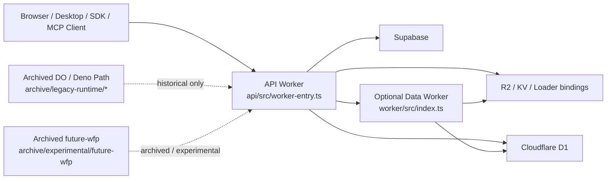

# Runtime Architecture Decision

Last reviewed: `2026-04-21`

This document is the Wave 4 runtime architecture ADR for launch hardening.
Its purpose is to make the live runtime story explicit before any archive or
legacy-removal PR deletes older paths.

## Canonical Statement

Ultralight's launch path runs the main API as a Cloudflare Worker from
[api/src/worker-entry.ts](../api/src/worker-entry.ts),
deployed by Wrangler and GitHub Actions through
[api/wrangler.toml](../api/wrangler.toml)
and
[.github/workflows/api-deploy.yml](../.github/workflows/api-deploy.yml).

The separate data-layer worker in
[worker/src/index.ts](../worker/src/index.ts)
is currently treated as a secondary internal service, not as the primary API
runtime. It remains active only where `WORKER_DATA_URL` and `WORKER_SECRET`
are configured and callers still rely on it.

The older DigitalOcean + Deno process path has now been moved under
[archive/legacy-runtime/api-main.ts](../archive/legacy-runtime/api-main.ts),
[archive/legacy-runtime/Dockerfile](../archive/legacy-runtime/Dockerfile),
and
[archive/legacy-runtime/do-app.yaml](../archive/legacy-runtime/do-app.yaml).
It is preserved only as archived historical reference and is not part of the
canonical launch path.

## Classification Table

| Path / surface | Classification | Current role | Release-critical? | Why it still exists | Wave 4 action |
| --- | --- | --- | --- | --- | --- |
| [api/src/worker-entry.ts](../api/src/worker-entry.ts) | Canonical | Main API fetch + scheduled runtime | Yes | This is the live Worker entrypoint used by Wrangler deploys | Keep and treat as the source of truth |
| [api/wrangler.toml](../api/wrangler.toml) | Canonical | Main API deployment/runtime config | Yes | Defines bindings, envs, and cron triggers for the live API Worker | Keep and maintain |
| [.github/workflows/api-deploy.yml](../.github/workflows/api-deploy.yml) | Canonical | Staging/prod API deploy path | Yes | This is the current deployment workflow for the API | Keep and maintain |
| [worker/src/index.ts](../worker/src/index.ts) | Secondary supported runtime | Internal data/code/D1 proxy worker behind feature flags | Yes, where enabled | Still has active callers and route inventory coverage | Decide in PR4.3 whether to retain or retire |
| [worker/wrangler.toml](../worker/wrangler.toml) | Secondary supported runtime | Deployment config for the internal data worker | Yes, where enabled | Needed while the data worker remains active | Reclassify with PR4.3 |
| [archive/legacy-runtime/api-main.ts](../archive/legacy-runtime/api-main.ts) | Archived artifact | Older Deno HTTP entrypoint | No | Preserved only as historical runtime reference | Keep in archive only |
| [archive/legacy-runtime/Dockerfile](../archive/legacy-runtime/Dockerfile) | Archived artifact | Older container entry path for the Deno runtime | No | Preserved only as historical DO/App Platform support | Keep in archive only |
| [archive/legacy-runtime/do-app.yaml](../archive/legacy-runtime/do-app.yaml) | Archived artifact | Older DigitalOcean deploy configuration | No | Preserved only as historical DO/App Platform support | Keep in archive only |
| [archive/experimental/future-wfp/](../archive/experimental/future-wfp) | Archived artifact | Future Workers-for-Platforms sandbox work | No | Preserved only as experimental/runtime research | Keep in archive only |
| [archive/root-migrations/](../archive/root-migrations) | Archived artifact | Old manual migration history | No | Schema history predating canonical `supabase/migrations/` | Keep in archive and fence new root files |
| [supabase/migrations/](../supabase/migrations) | Canonical | Launch-critical schema history | Yes | Current source of truth for DB migrations | Keep and maintain |

## Architecture Diagram

## What Counts As Canonical

- Operator docs should describe
  [api/src/worker-entry.ts](../api/src/worker-entry.ts)
  as the API entrypoint.
- Release instructions should reference the Wrangler/GitHub Actions flow, not a
  Deno process manager or Docker deployment path.
- Staging and production smoke checks should assume the Cloudflare Worker API
  URLs, not a DO app host.
- New launch-critical backend work should target the canonical Worker runtime
  and canonical Supabase migration tree first.

## What Counts As Transitional

- The data worker remains transitional or secondary until PR4.3 confirms
  whether it stays part of the supported production architecture.
- Compatibility shims in auth, widgets, aliases, and Supabase config are
  transitional only while their telemetry and migration plans remain active.

## What Counts As Historical Or Experimental

- [archive/root-migrations/](../archive/root-migrations)
  is historical reference only.
- [archive/legacy-runtime/api-main.ts](../archive/legacy-runtime/api-main.ts),
  [archive/legacy-runtime/Dockerfile](../archive/legacy-runtime/Dockerfile),
  and
  [archive/legacy-runtime/do-app.yaml](../archive/legacy-runtime/do-app.yaml)
  are historical deployment artifacts, not part of the launch runtime.
- [archive/experimental/future-wfp/](../archive/experimental/future-wfp)
  is experimental research, not the live runtime.

## Follow-On PR Dependencies

- `PR4.2` is the archive move produced from this ADR and is now implemented locally.
- `PR4.3` depends on this ADR to decide the data worker's final status.
- `PR4.4` is the root-migration archive and fence produced from this ADR and is
  now implemented locally.
- `PR4.14` is the experimental/archive cleanup produced from this ADR and is
  now implemented locally.

## Manual Signoff Deferred To End Of Wave 4

The only human decision still required after the code/docs work is whether the
data worker remains part of the supported production architecture. Everything
else in this ADR is grounded in the current repo and workflow state.
